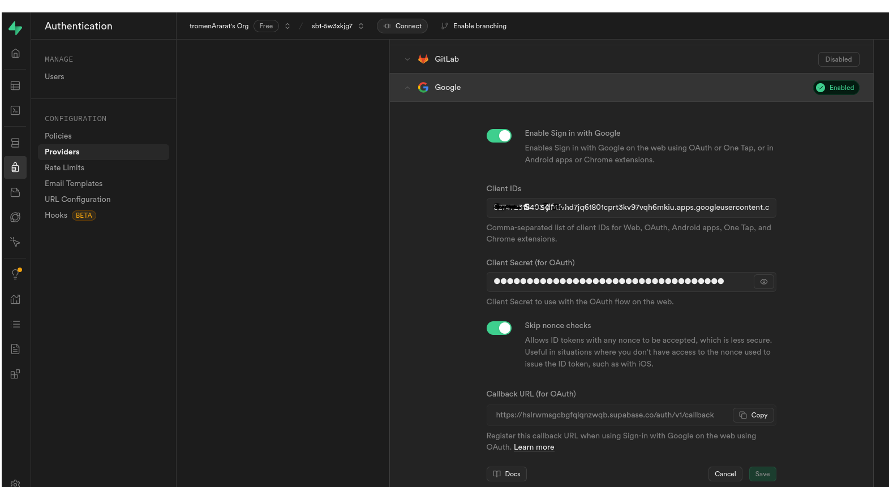

# tuffPrompt
Aplicación para gestionar préstamos de libros, creada a partir de prompts a las ia bolt y openai. Incluye autenticación por terceros y consultas a la API googleBooks para facilitar la carga.

## Página principal:

## Perfil:

## Carga de libros:

## Base de datos

## Autenticación desde Supabase
